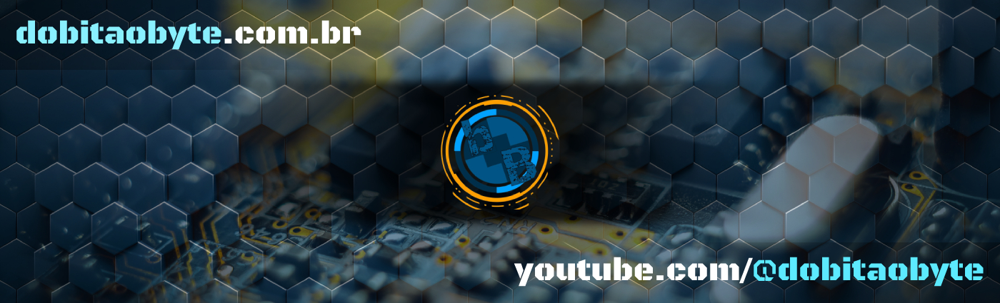

### Artigos mais atuais do canal
<!-- BLOG-POST-LIST:START -->
- [Qual RF usar? HC12 ou SX1278?](https://www.manualdomaker.com/article/qual-rf-usar-hc-12-ou-sx-1278/)
- [Como conectar ao Linux do WSL via SSH](https://www.manualdomaker.com/article/como-conectar-ao-linux-do-wsl-via-ssh/)
- [Como fazer túnel reverso SSH](https://www.manualdomaker.com/article/como-fazer-tunel-reverso-ssh/)
- [Manual do Maker e Do bit Ao Byte](https://www.manualdomaker.com/article/manual-do-maker-e-do-bit-ao-byte/)
- [Criar interface com SquareLine Studio e VS Code](https://www.manualdomaker.com/article/criar-interface-com-square-line-studio-e-vs-code/)
<!-- BLOG-POST-LIST:END -->

### Vídeos mais atuais do canal
<!-- YOUTUBE-POST-LIST:START -->
- [Mundo Digital : O telefone nos dias atuais](https://www.youtube.com/watch?v=oSUOf1znQPs)
- [EasyMaker-AS - Gif animado no ESP32](https://www.youtube.com/watch?v=FxwwzkmMvfE)
- [EasyMaker Animation Studio for x86 and MCUs](https://www.youtube.com/watch?v=3nGWqujnzlQ)
- [T Display S3 - colisão de objetos](https://www.youtube.com/watch?v=VjoNu9SCD40)
- [T-Display S3 - Tutorial #01](https://www.youtube.com/watch?v=CCTERa9nWV0)
<!-- YOUTUBE-POST-LIST:END -->